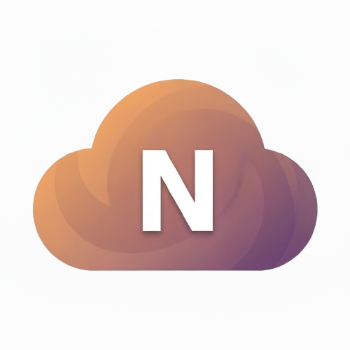

<p align="center">
  <a href="https://www.microberelay.com/">
    
  </a>
</p>

<h1 align="center">Microbe Relay</h1>

<p align="center"><strong>An interactive learning experience about ocean microbes, nitrogen cycling, and climate.</strong></p>

<p align="center">
  <a href="https://www.microberelay.com/">
    
  </a>
  <a href="https://sites.google.com/view/xinsun">
    
  </a>
  
  
</p>

## What Microbe Relay does

Microbe Relay turns ocean denitrification into a guided, interactive story. Students see how microbes divide a multi-step chemical pathway, then change food and oxygen conditions to discover which specialists thrive and when nitrous oxide can build up.

The experience was developed through the University of Pennsylvania's Sun Lab for high school environmental science classrooms and introductory college teaching.

## The learning experience

- Begin with low-oxygen ocean environments and the climate stakes
- Learn the relay from nitrate to nitrite, nitrous oxide, and nitrogen gas
- Make predictions in a short pre-assessment
- Adjust food levels and watch microbial specialists hand off each step
- Complete three timed missions and explore real-ocean scenarios
- Retake the same questions and see a question-by-question comparison

Teachers can also download the [classroom worksheet](https://www.microberelay.com/files/MicrobeRelay_Worksheet.docx) and [teacher's guide](https://www.microberelay.com/files/MicrobeRelay_TeachersGuide.docx).

## Research context

Microbe Relay translates the research behind [*Ecological dynamics explain modular denitrification in the ocean*](https://doi.org/10.1073/pnas.2417421121) into a classroom experience. The central idea is that denitrification is often shared among microbial specialists rather than completed by a single organism.

Food availability changes the outcome:

- **Scarce food:** efficient first-step specialists dominate
- **Moderate food:** several specialists coexist, creating opportunities for N₂O to accumulate
- **Abundant food:** longer pathways can complete the relay and convert N₂O to N₂

During its research rollout, Microbe Relay reached 285 users and was used in a Penn course and six AP Environmental Science classes. The assessment system recorded more than 480 question-level responses.

## How the app is built

The front end uses React, TypeScript, Vite, Tailwind CSS, and shadcn/ui. The interactive model in `src/lib/relay-state.ts` maps food levels to active pathway steps and an N₂O response curve. Supabase stores the pre-assessment, post-assessment, and linked learning comparisons across seven tables.

Anonymous browser-generated IDs connect each learner's pre- and post-assessment sessions. No account is required.

## Run it locally

You will need Node.js 18 or newer and a Supabase project with the seven assessment tables.

```bash
git clone https://github.com/NavadeepBudda/microbe-relay.git
cd microbe-relay
npm install
```

Create `.env.local`:

```bash
VITE_SUPABASE_URL=your_supabase_project_url
VITE_SUPABASE_ANON_KEY=your_supabase_anon_key
```

Then start the development server:

```bash
npm run dev
```

Open [http://localhost:5173](http://localhost:5173).

## Useful commands

```bash
npm run dev         # Start the development server
npm run build       # Create a production build
npm run build:dev   # Create a development-mode build
npm run lint        # Run ESLint
npm run preview     # Preview the production build
```

## Project structure

```text
src/pages/                 Guided learning routes and scenarios
src/components/            Interactive models, assessments, and interface
src/lib/relay-state.ts     Food-level and N₂O simulation logic
src/lib/*test-service.ts   Pre- and post-assessment session handling
src/lib/comparison-service.ts
                           Linked, question-level learning comparisons
public/files/              Classroom worksheet and teacher's guide
```

## Project team

Microbe Relay was developed by [Navadeep Budda](https://github.com/NavadeepBudda) through the [Sun Lab](https://sites.google.com/view/xinsun) at the University of Pennsylvania.

This repository does not currently include an open-source license. Please contact the project team before reusing or redistributing the code.
